# Computer Graphics (Γραφική με Υπολογιστές) — AUTh ECE

[](https://www.python.org/)
[](https://numpy.org/)
[](https://matplotlib.org/)
[](LICENSE)
[](https://ece.auth.gr/)

Academic coursework and software implementations for **Computer Graphics (Γραφική με Υπολογιστές)**, taught in the 8th semester (Spring 2024) at the Department of Electrical and Computer Engineering, **Aristotle University of Thessaloniki (AUTh)**.

**Author**: Dimitrios Ioannidis  
**Academic Year**: 2023 – 2024 (8th Semester)

---

## 📌 Overview

This repository contains a modular **3D Software Rendering Pipeline** built from first mathematical principles using pure **Python** and **NumPy**, visualized with **Matplotlib**. Without relying on hardware graphics APIs (such as OpenGL, DirectX, or Vulkan), every stage of the 3D graphics rendering pipeline is implemented from scratch:

1. **Polygon Rasterization & Color Interpolation**: Scanline triangle rasterization with linear / barycentric interpolation.
2. **Shading Models**: Implementation and comparison of **Flat Shading**, **Gouraud Shading**, and **Phong Shading**.
3. **Affine 3D Transformations**: Translation, arbitrary-axis rotation (Rodrigues' rotation formula), and non-uniform scaling.
4. **Camera Viewing & Projection Pipeline**: Camera frame construction (`Look-At` matrix), perspective frustum projection, clipping, and viewport transformation.
5. **Illumination Models**: Multi-source **Phong Reflection Model** combining ambient, diffuse, and specular components.
6. **Texture Mapping**: UV coordinate interpolation with **Bilinear Texture Filtering**.

---

## 📁 Repository Structure

```text
computer-graphics-auth/
├── 01-flat-and-gouraud-shading/
│   ├── assignment/
│   │   └── cg-hw1-2024.pdf             # Original assignment specification (in Greek)
│   ├── assets/
│   │   ├── flat-shading-output.png     # Rendered output using Flat Shading
│   │   └── gouraud-shading-output.png  # Rendered output using Gouraud Shading
│   ├── demo_f.py                       # Demonstration script for Flat Shading
│   ├── demo_g.py                       # Demonstration script for Gouraud Shading
│   ├── f_shading.py                    # Flat shading implementation
│   ├── g_shading.py                    # Gouraud shading implementation
│   ├── hw1.npy                         # 3D mesh vertices and triangle face data
│   ├── render_img.py                   # Canvas initialization and image saving utilities
│   └── vector_interp.py                # Linear vector interpolation along triangle edges & scanlines
│
├── 02-transformations-and-projections/
│   ├── assignment/
│   │   └── hw2_2024.pdf                # Original assignment specification (in Greek)
│   ├── assets/
│   │   ├── step_0.jpg                  # Transformation pipeline stage 0
│   │   ├── step_1.jpg                  # Transformation pipeline stage 1
│   │   ├── step_2.jpg                  # Transformation pipeline stage 2
│   │   └── step_3.jpg                  # Transformation pipeline stage 3
│   ├── demo.py                         # Full pipeline demonstration script
│   ├── hw2.npy                         # Complex 3D mesh model
│   ├── lookat.py                       # Camera view matrix (Eye, Target, Up)
│   ├── perspective_project.py          # Frustum perspective projection & NDC mapping
│   ├── rasterize.py                    # 2D screen-space triangle rasterizer
│   ├── render_object.py                # End-to-end mesh rendering orchestration
│   ├── shading.py                      # Shading helpers
│   ├── transform.py                    # 3D affine transforms & Rodrigues rotation
│   └── world2view.py                   # World-to-camera coordinate transformation
│
├── 03-lighting-and-texture-mapping/
│   ├── assignment/
│   │   └── hw3_2024.pdf                # Original assignment specification (in Greek)
│   ├── assets/
│   │   ├── cat_diff.png                # Diffuse texture map
│   │   ├── no_texture_map/             # Shading comparisons without texture
│   │   └── with_texture_map/           # Shading comparisons with texture mapping
│   ├── cat_diff.png                    # Texture asset loaded by demo scripts
│   ├── demo.py                         # Illumination and rendering demo
│   ├── demo_extra.py                   # Texture mapping demo script
│   ├── g_shading.py                    # Gouraud normal and color interpolator
│   ├── h3.npy                          # 3D mesh model with UV coordinates & normals
│   ├── lighting.py                     # Phong illumination model (Ambient, Diffuse, Specular)
│   ├── lookat.py                       # Camera coordinate transformation
│   ├── perspective_project.py          # Perspective projection module
│   ├── rasterize.py                    # Depth-aware triangle rasterizer
│   ├── shading.py                      # Per-pixel and per-vertex shading interfaces
│   └── texture_map.py                  # Bilinear texture interpolation and UV sampler
│
├── .gitignore                          # Standard Python, LaTeX, and build ignores
├── LICENSE                             # MIT License
├── README.md                           # Course showcase documentation
└── requirements.txt                    # Project dependencies
```

---

## 🔬 Assignments Breakdown & Results

### 1. Rasterization & Shading: Flat vs. Gouraud (`01-flat-and-gouraud-shading`)

The first assignment focused on rasterizing 2D projections of 3D triangular meshes onto a discrete pixel canvas using scanline algorithms and vector interpolation.

- **Scanline Rasterization**: For every triangle defined by vertices $V_1, V_2, V_3$, horizontal scanlines are evaluated between the minimum and maximum $y$-coordinates. Active edge intersections define horizontal spans $[x_{start}, x_{end}]$.
- **Flat Shading**: Evaluates the color uniformly per triangle face (typically using face centroids or initial vertex values). Each polygon exhibits distinct boundaries, producing a faceted appearance.
- **Gouraud Shading**: Calculates illumination at each vertex, then interpolates the resulting colors bilinearly across the triangle: first along the bounding edges, then horizontally along each scanline. This creates smooth color gradients across adjacent polygons.

#### 📊 Results Showcase

| Flat Shading (Faceted) | Gouraud Shading (Smooth Gradients) |
| :---: | :---: |
| 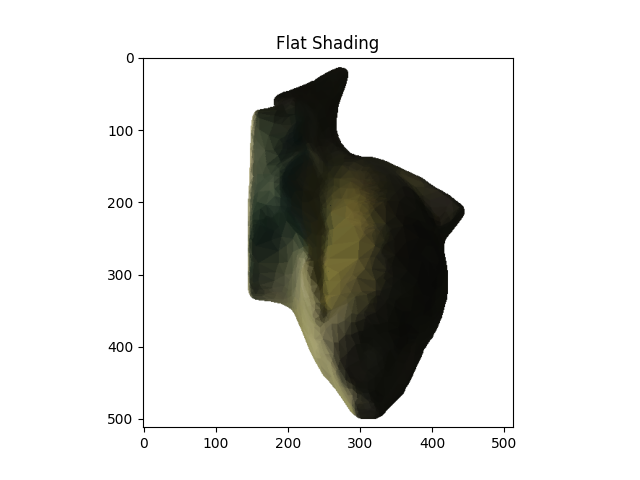 |  |

📄 **Original Assignment Spec**: [cg hw1 2024 (PDF)](01-flat-and-gouraud-shading/assignment/cg-hw1-2024.pdf)

---

### 2. 3D Transformations & The Viewing Pipeline (`02-transformations-and-projections`)

The second assignment constructs the geometric core of a 3D graphics engine, converting raw 3D mesh coordinates from object space to screen space through affine transformation matrices and perspective projection.

- **Affine Transformations (`transform.py`)**:
  - **Translation**: Moves objects by vector $\mathbf{t} = [t_x, t_y, t_z]^T$.
  - **Scaling**: Non-uniform scaling by diagonal scale matrix $\mathbf{S}(s_x, s_y, s_z)$.
  - **Arbitrary-Axis Rotation**: Implements **Rodrigues' Rotation Formula** to rotate points by angle $\theta$ around any unit vector $\mathbf{u} = [u_x, u_y, u_z]^T$:
    $$\mathbf{R}(\mathbf{u}, \theta) = \mathbf{I}\cos\theta + (1 - \cos\theta)(\mathbf{u}\mathbf{u}^T) + \sin\theta [\mathbf{u}]_\times$$
- **Camera View Coordinate System (`lookat.py`)**:
  - Constructs an orthonormal camera coordinate frame from camera position $\mathbf{c}_0$, target look-at point $\mathbf{c}_{look}$, and up vector $\mathbf{c}_{up}$.
  - Computes unit vectors: $\mathbf{z}_c = \frac{\mathbf{c}_{look} - \mathbf{c}_0}{\|\mathbf{c}_{look} - \mathbf{c}_0\|}$, $\mathbf{x}_c = \frac{\mathbf{c}_{up} \times \mathbf{z}_c}{\|\mathbf{c}_{up} \times \mathbf{z}_c\|}$, $\mathbf{y}_c = \mathbf{z}_c \times \mathbf{x}_c$.
- **Perspective Projection (`perspective_project.py`)**:
  - Maps 3D camera coordinates to 2D normalized device coordinates (NDC) using camera focal length and perspective division:
    $$x_p = f \frac{X_c}{Z_c}, \quad y_p = f \frac{Y_c}{Z_c}$$
  - Transforms NDC coordinates into target pixel canvas dimensions $[W \times H]$.

#### 📊 Results Showcase

Below are sequential frames demonstrating 3D object transformations, camera motion, and perspective projections:

| Stage 0 | Stage 1 |
| :---: | :---: |
| 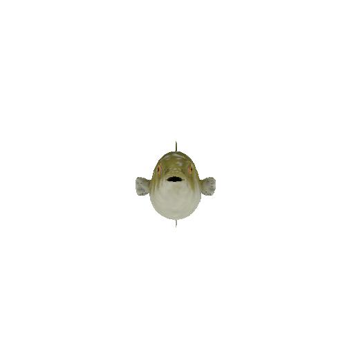 | 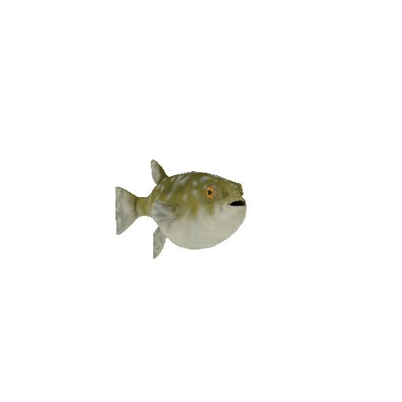 |
| **Stage 2** | **Stage 3** |
| 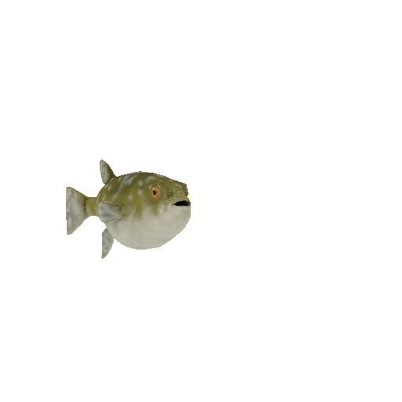 | 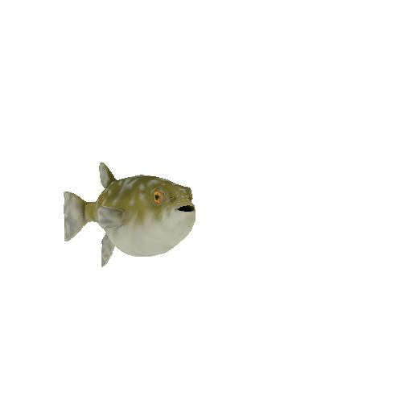 |

📄 **Original Assignment Spec**: [hw2 2024 (PDF)](02-transformations-and-projections/assignment/hw2_2024.pdf)

---

### 3. Illumination Models, Phong Shading & Texture Mapping (`03-lighting-and-texture-mapping`)

The final assignment implements physically-inspired illumination models and surface texture mapping on 3D meshes.

- **Phong Illumination Model (`lighting.py`)**:
  Calculates the perceived light intensity at surface points by summing ambient, diffuse, and specular contributions across multiple light sources $i$:
  $$I = I_a k_a + \sum_{i} \left[ I_{d,i} k_d (\mathbf{N} \cdot \mathbf{L}_i) + I_{s,i} k_s (\mathbf{V} \cdot \mathbf{R}_i)^n \right]$$
  - **Ambient**: Constant baseline illumination representing indirect environmental bounce.
  - **Diffuse (Lambertian)**: Reflection proportional to the cosine of the angle between surface normal $\mathbf{N}$ and light direction $\mathbf{L}_i$.
  - **Specular**: Highlights formed when reflection vector $\mathbf{R}_i = 2(\mathbf{N} \cdot \mathbf{L}_i)\mathbf{N} - \mathbf{L}_i$ aligns with viewing direction $\mathbf{V}$, governed by shininess factor $n$.
- **Gouraud vs. Phong Shading**:
  - *Gouraud Shading*: Computes Phong lighting at mesh vertices and bilinearly interpolates color across faces (computationally lighter, but misses specular highlights within large triangles).
  - *Phong Shading*: Bilinearly interpolates normal vectors $\mathbf{N}$ across faces and evaluates the Phong equation per pixel, yielding accurate specular highlights and curved appearance.
- **Texture Mapping & Bilinear Interpolation (`texture_map.py`)**:
  - Maps 2D texture coordinates $(u, v) \in [0, 1]^2$ to surface coordinates.
  - Implements **Bilinear Filtering** to calculate sub-pixel texture samples via 4 neighboring texels, eliminating pixelated nearest-neighbor artifacts.

#### 📊 Illumination Component Breakdown

| Ambient Only | Diffuse Only | Specular Only | Full Illumination |
| :---: | :---: | :---: | :---: |
| 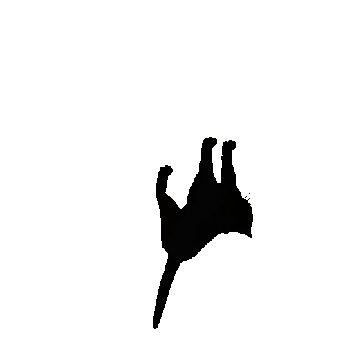 | 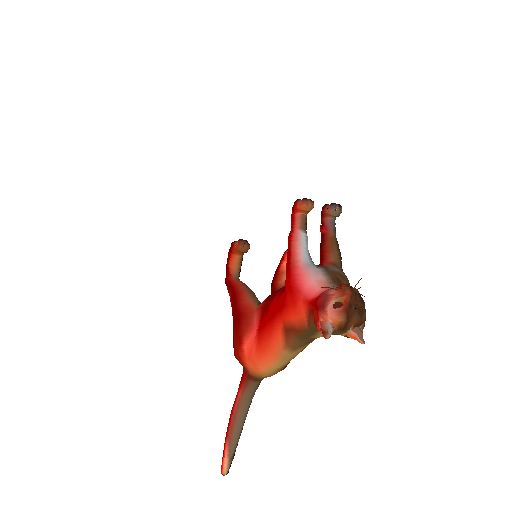 |  |  |

#### 📊 Multi-Light Source Contribution (Phong Model)

| Light Source 1 | Light Source 2 | Light Source 3 | All 3 Lights Combined |
| :---: | :---: | :---: | :---: |
|  | 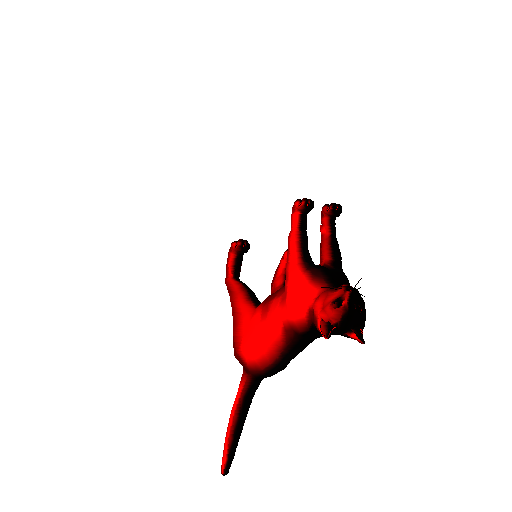 | 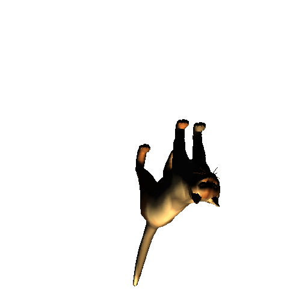 | 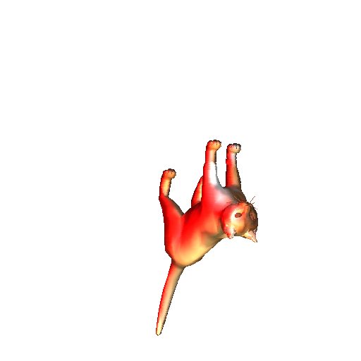 |

#### 📊 Shading Comparison: Gouraud vs. Phong

| Shading Model | Non-Textured (All Lights) | With Texture Mapping |
| :---: | :---: | :---: |
| **Gouraud Shading**<br>*(Interpolating colors at vertices)* |  |  |
| **Phong Shading**<br>*(Interpolating normals per pixel)* |  | 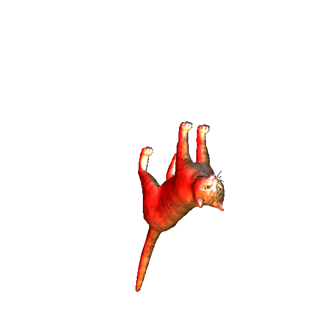 |

#### 📊 Texture Mapping with Bilinear Filtering

| Diffuse Texture Map (`cat_diff.png`) | Rendered Model with Texture & Specular Highlights |
| :---: | :---: |
| 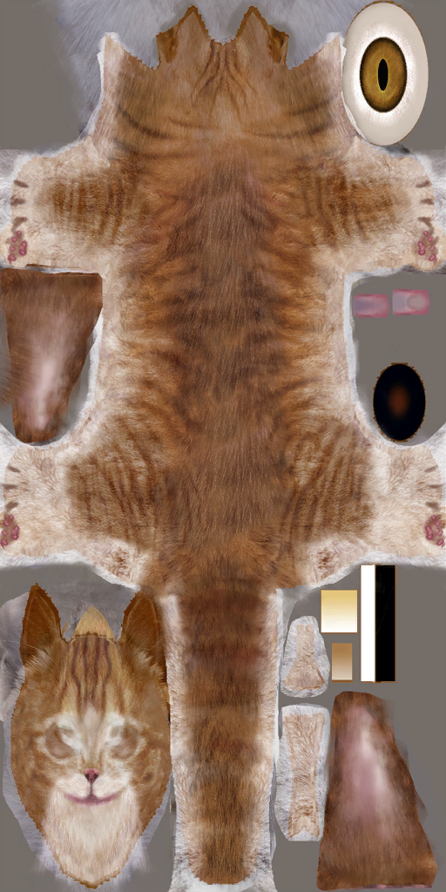 |  |

📄 **Original Assignment Spec**: [hw3 2024 (PDF)](03-lighting-and-texture-mapping/assignment/hw3_2024.pdf)

---

## 💻 Running the Demos

Install the required dependencies (`pip install -r requirements.txt`) and run any demo directly:

```bash
# 1. Flat & Gouraud Shading
cd 01-flat-and-gouraud-shading
python demo_f.py          # Flat Shading
python demo_g.py          # Gouraud Shading

# 2. Transformations & Viewing Pipeline
cd ../02-transformations-and-projections
python demo.py            # 3D affine transforms, Look-At camera & perspective projection

# 3. Illumination & Texture Mapping
cd ../03-lighting-and-texture-mapping
python demo.py            # Multi-light Phong & Gouraud illumination
python demo_extra.py      # Texture mapping with bilinear filtering
```
